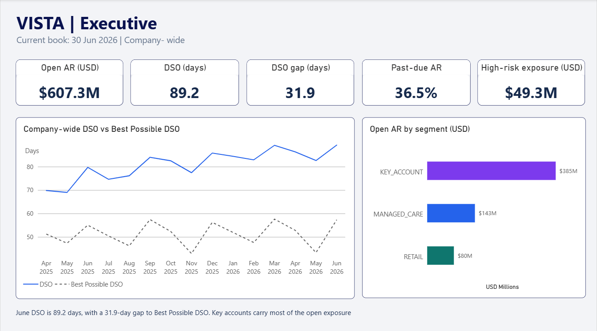
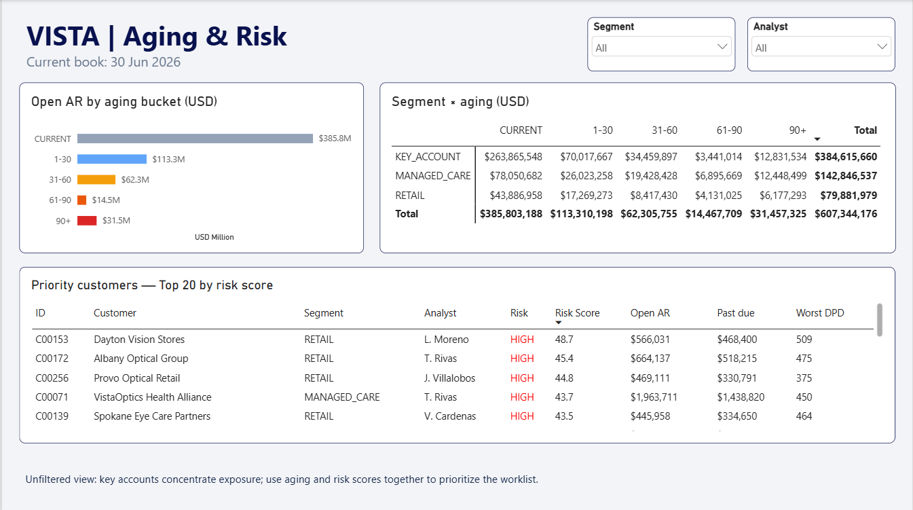
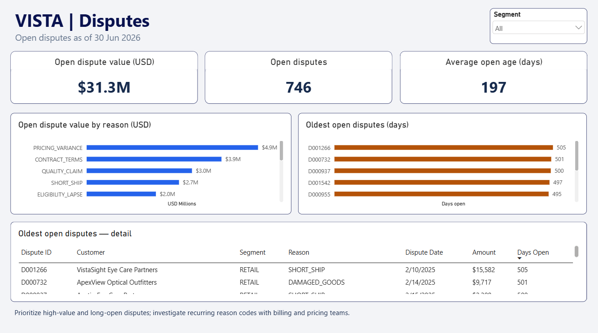
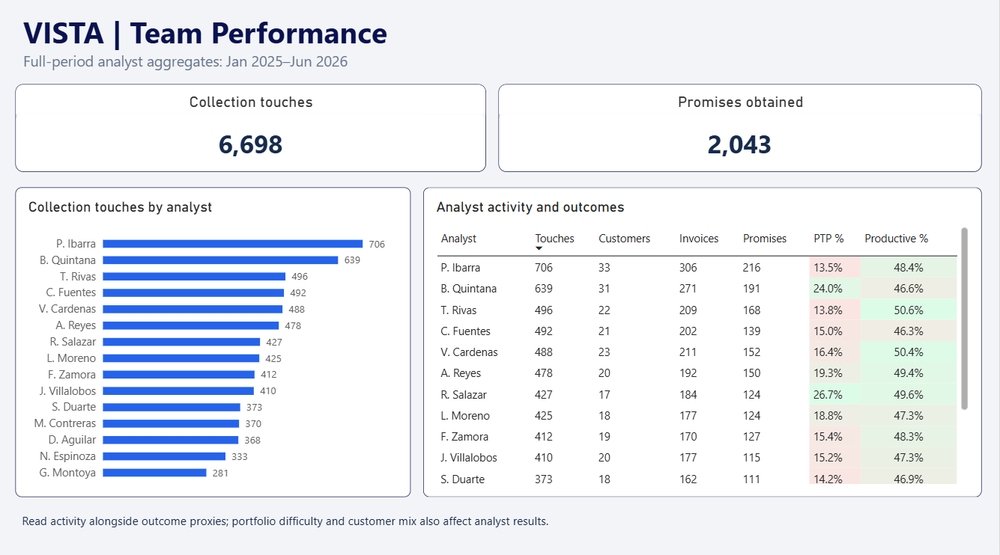
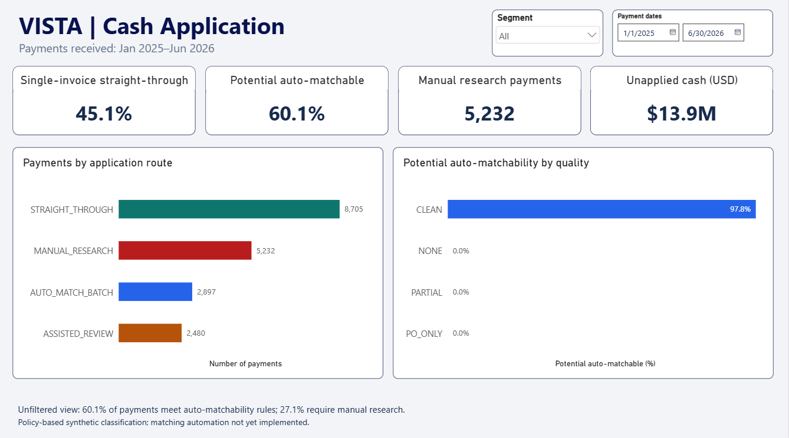

# VISTA — AR Collections Analytics

Receivables analytics for a multi-segment optical distributor, built with
**Python → SQL Server → Power BI** on a seeded, synthetic 18-month AR book.

[View report PDF](powerbi/VISTA-Power_BI_Report_PDF.pdf) · [Watch report walkthrough](https://mario-narvaez.github.io/Vista-AR-Project/) · [Download Power BI report](powerbi/VISTA-Power_BI_Report.pbix)

The PDF shows all five report pages. The one-minute walkthrough demonstrates
navigation and filtering in the browser. The PBIX requires **Power BI Desktop**.
All three present the same synthetic AR scenario.



[GitHub repository](https://github.com/mario-narvaez/Vista-AR-Project) · [Technical implementation](#technical-implementation) · [Findings](#findings) · [Validation evidence](#validation-evidence)

VISTA answers the three questions a collections manager needs on Monday
morning:

1. Where is the cash, and is it getting slower?
2. Which accounts are about to hurt us?
3. Where should the team spend this week?

## Why this project

Static aging reports say how much AR is old. They rarely explain why the number
moved, which customers are deteriorating, or what a collections team should do
next.

VISTA uses synthetic data only, but the business design comes from five years
in global AR operations across key accounts, managed care, retail collections,
reconciliation, automation and collections leadership. It turns that operating
context into a reproducible portfolio project rather than a generic dashboard.

## Technical implementation

The reporting layer contains **nine SQL views and 33 DAX measures**. SQL Server
handles balances, historical snapshots and classifications; the Power BI model
and DAX control how those outputs respond to report selections.

### Analytical views

All reporting reads from these views rather than raw transaction tables.

| View | Decision it supports |
|---|---|
| [`vw_invoice_status`](sql/03_views.sql) | Current invoice balance, days past due, aging bucket and dispute state |
| [`vw_ar_aging`](sql/03_views.sql) | Customer-level AR aging |
| [`vw_ar_snapshot_monthly`](sql/03_views.sql) | AR reconstructed at each month end |
| [`vw_dso_monthly`](sql/03_views.sql) | Historical DSO, Best Possible DSO, CEI and past-due percentage |
| [`vw_cash_application`](sql/03_views.sql) | Payment matchability, application route and unapplied cash |
| [`vw_customer_risk`](sql/03_views.sql) | Customer risk score and weekly worklist |
| [`vw_dispute_analysis`](sql/03_views.sql) | Dispute value, reason, status and age |
| [`vw_analyst_performance`](sql/03_views.sql) | Activity, promise-to-pay timing proxy and productive-touch rate |
| [`vw_exec_kpi`](sql/03_views.sql) | Latest headline metrics for an executive summary |

**Rolling calculations — `vw_dso_monthly`**

This excerpt uses a windowed sum for trailing three-month sales and `LAG` for
the previous AR balance used by CEI. Monthly balances are reconstructed from
invoice and application dates before these calculations run.

```sql
SUM(sa.credit_sales) OVER (
    ORDER BY s.month_end
    ROWS BETWEEN 2 PRECEDING AND CURRENT ROW
) AS sales_3m,
LAG(s.ar_balance) OVER (ORDER BY s.month_end) AS ar_balance_prior
```

<details>
<summary>Payment classification — <code>vw_cash_application</code></summary>

Ordered `CASE` conditions distinguish single-invoice and batch matching
candidates from assisted review and manual research. These are classification
rules for potential automation.

```sql
CASE WHEN remittance_quality = 'CLEAN'
          AND invoices_covered = 1
          AND unapplied_amount = 0 THEN 'STRAIGHT_THROUGH'
     WHEN remittance_quality = 'CLEAN'
          AND invoices_covered > 1
          AND unapplied_amount = 0 THEN 'AUTO_MATCH_BATCH'
     WHEN remittance_quality = 'PARTIAL'
          AND unapplied_amount = 0 THEN 'ASSISTED_REVIEW'
     ELSE 'MANUAL_RESEARCH'
END AS application_route
```

</details>

### DAX and filter context

**Current snapshot — `Current Total AR`**

```dax
Current Total AR =
CALCULATE (
    SUM ( vw_invoice_status[open_amount] ),
    KEEPFILTERS ( vw_invoice_status[is_settled] = 0 ),
    REMOVEFILTERS ( dim_date )
)
```

`CALCULATE` changes the filter context. `KEEPFILTERS` intersects the open-invoice
condition with the existing selection; `REMOVEFILTERS(dim_date)` preserves the
final-date snapshot while retaining customer and segment selections.

<details>
<summary>Route percentage — <code>Payment Route Share %</code></summary>

```dax
Payment Route Share % =
DIVIDE (
    [Payment Count],
    CALCULATE (
        [Payment Count],
        REMOVEFILTERS ( vw_cash_application[application_route] )
    )
)
```

The numerator retains the selected route. The denominator removes only the route
filter, keeping segment, date and other payment filters. `DIVIDE` returns blank
when the denominator is zero.

</details>

See the [SQL design walkthrough](docs/PROJECT_DEEP_DIVE.md#current-balances-and-historical-dso)
and the [complete DAX reference](powerbi/04_dax_measures.md#4-measures-by-home-table)
for the full calculations and their scope.

## Findings

Current-book figures are as of **30 June 2026**. Payment and team activity figures
cover **January 2025–June 2026**. These results describe the synthetic scenario.

| Area | Result | Business implication |
|---|---|---|
| Open receivables | **$607.3M** gross open AR; **36.5%** past due | The overdue portion needs targeted collection and dispute follow-up. |
| DSO | **69.8 days** in April 2025 → **89.2 days** in June 2026; latest Best Possible DSO **57.3 days**, gap **31.9 days** | Receivables became slower over the usable trend period; the gap quantifies past-due exposure in days of sales. |
| Concentration | **35 key accounts** hold **63.3%** of open AR, or **$384.6M** | Large-account follow-up has a disproportionate effect on portfolio exposure. |
| Customer risk | **41 HIGH-risk customers** with **$49.3M** open exposure | Combine the risk ranking with balance size and aging when prioritizing the worklist. |
| Disputes | **746** open disputes worth **$31.3M**, with an average age of **197.4 days** | Prioritize high-value, long-open cases; pricing variance is the largest reason category at **$4.9M**. |
| Cash application | **60.1%** of payments meet potential auto-matchability rules; **27.1%** require manual research; **$13.9M** is recorded as unapplied cash | Separate payments suitable for automation from cases requiring investigation. |
| Team activity | **6,698** collection touches and **2,043** promises obtained across **15 analysts** | Review activity alongside the analyst-level outcome proxies and customer mix. |

Average days paid late on settled invoices also differ by segment:
**65.9** for managed care, **53.5** for retail and **35.4** for key accounts.
The scenario supports segment-specific follow-up rather than one uniform policy.

The payment routes are **45.1% straight-through**, **15.0% batch-matchable**,
**12.8% assisted review** and **27.1% manual research**. Straight-through and
batch-matchable together make up the **60.1%** potential automation share;
assisted review and manual research make up the **39.9%** human-review share.

## What is in the repository

| Component | What it does | Details |
|---|---|---|
| [Synthetic CSV data](data/) | Seven included datasets, ready to inspect or load into SQL Server without running Python. | [Data design](#data-design) |
| [Python generator](generator/generate_ar_data.py) | Optionally regenerates the seeded synthetic datasets. | [Design notes](docs/PROJECT_DEEP_DIVE.md) |
| [SQL schema](sql/01_schema.sql) | Creates the relational model, keys, checks and indexes. | [Design notes](docs/PROJECT_DEEP_DIVE.md) |
| [SQL loader](sql/02_load.sql) | Loads CSVs through staging tables and validates row counts. | [Execution guide](BUILD_GUIDE.md) |
| [Analytical views](sql/03_views.sql) | Produces the current-book, risk, DSO, disputes, team and cash-application layers. | [View map](#analytical-views) |
| [SQL verification](sql/04_verify.sql) | Produces the figures and result grids used to validate the build. | [Execution guide](BUILD_GUIDE.md) |
| [Power BI report](powerbi/VISTA-Power_BI_Report.pbix) | Saved five-page report and imported semantic model; requires Power BI Desktop. | [Model and DAX](powerbi/04_dax_measures.md) |
| [Report PDF](powerbi/VISTA-Power_BI_Report_PDF.pdf) | Static export of all five report pages, viewable without Power BI. | [Dashboard screenshots](#dashboard) |
| [Report walkthrough](https://mario-narvaez.github.io/Vista-AR-Project/) | One-minute recording of page navigation and filtering, playable in the browser. | [Download MP4](powerbi/VISTA-Power_BI_Report_Walkthrough.mp4) |
| [Power BI model and DAX](powerbi/04_dax_measures.md) | Defines the model, relationships, measures and five report pages. | [Execution guide](BUILD_GUIDE.md) |
| [Build log](docs/BUILD_LOG.md) | Records selected evidence of local execution and validation, without a screenshot for every click. | [Execution guide](BUILD_GUIDE.md) |

## Data design

The generator creates three intentionally different segments:

| Segment | Behaviour modelled |
|---|---|
| **MANAGED_CARE** | adjudication delays, denial/eligibility disputes and consolidated remittances |
| **RETAIL** | high transaction volume, deductions, chargebacks and pricing variance |
| **KEY_ACCOUNT** | few large invoices, negotiated terms and concentration risk |

All seven synthetic CSV datasets are committed in [data/](data/) so reviewers
can inspect and use them directly. The optional generator recreates the same
seeded scenario.

The included data contains 300 customers, 30,965 invoices, 19,314 payments,
32,184 payment applications, 1,723 disputes, 6,698 collection activities and
636 date rows.

## Dashboard

| Page | Business question |
|---|---|
| **Executive** | Is AR getting slower, and what is the DSO opportunity? |
| **Aging & Risk** | Which customers should the team work first? |
| **Disputes** | Which disputes are blocking cash and why? |
| **Team Performance** | Are analysts producing outcomes, not just activity? |
| **Cash Application** | Which payments can be automated, assisted or need manual research? |

### Aging & Risk



### Disputes



### Team Performance



### Cash Application



## Validation evidence

The local SQL checkpoints below provide the reference results for aging, DSO,
customer risk and payment routing. The report screenshots show the corresponding
Power BI outputs.

| Check | Evidence | Reference result |
|---|---|---|
| Aging profile | [SQL aging results](screenshots/sql/01-aging-profile.png) | Current $385.8M; 1–30 $113.3M; 31–60 $62.3M; 61–90 $14.5M; 90+ $31.5M |
| Monthly DSO | [SQL DSO trend](screenshots/sql/02-dso-trend.png) | June DSO 89.2; BPDSO 57.3; gap 31.9 days |
| Risk bands | [SQL risk results](screenshots/sql/03-risk-bands.png) | HIGH 41 / $49.3M; MEDIUM 146 / $251.9M; LOW 113 / $306.2M |
| Cash-application routes | [SQL route results](screenshots/sql/04-cash-application.png) | Straight-through 8,705; batch-matchable 2,897; assisted review 2,480; manual research 5,232 |

Implementation evidence: [Python generation](screenshots/build/00-python-generation.png),
[SQL load and row counts](screenshots/build/01-sql-load.png), and
[Power BI model](screenshots/build/03-powerbi-model.png).
The [build log](docs/BUILD_LOG.md) records the local implementation checkpoints.
[SQL verification output](screenshots/sql/verification-output.txt) preserves
the successful read-only rerun of all ten blocks on **5 October 2026**.

## Run locally

Open [VISTA-Power_BI_Report.pbix](powerbi/VISTA-Power_BI_Report.pbix) in Power BI Desktop to explore the saved
report with its imported data. The source [CSVs](data/) are also included for
inspection and direct use.

To refresh from a local SQL source, use the included CSVs with SQL Server 2017
or later. Run the scripts in order (schema → load → views → verification), then
connect the PBIX to your local `VISTA_AR` database and refresh. The
[execution guide](BUILD_GUIDE.md) covers the CSV location, loading and connection
setup.

Python and the [listed dependencies](requirements.txt) are needed only for
[optional regeneration](BUILD_GUIDE.md#optional-regenerate-the-data).

## Notes and limitations

- This is a synthetic data set; it represents no real company, customer or
  transaction.
- The first three months have no opening AR balance. Use April 2025 onward for
  the DSO trend.
- Dynamic as-of-date aging is intentionally deferred from v1 because accurate
  historical reconstruction needs payment-application history by selected date.
- The Team page measures a payment-timing proxy for promises kept; it does not
  claim to know a promised payment amount.
- DSO is company-wide; the monthly view does not support customer/segment DSO.
- Cash-application routes express rule-based automation potential in the
  synthetic scenario, not success rates from a deployed matching engine.
- Gross open AR is **$607.3M**, excluding settled invoices and credit balances;
  the generator's **$606.9M** net AR includes credit balances.
- Current aging treats invoices due on the cutoff date as past due; the monthly
  snapshot treats them as current. This explains **36.5%** current-book past due
  versus **35.8%** in the June monthly snapshot.
- Open dispute value sums disputed amounts and is not capped to remaining invoice
  balances; it is not guaranteed recoverable cash or incremental AR.
- Customer risk is a heuristic score, not a validated probability of default.

## Further reading

- [Detailed design narrative](docs/PROJECT_DEEP_DIVE.md)
- [Execution guide](BUILD_GUIDE.md)
- [Power BI model and measures](powerbi/04_dax_measures.md)
- [Local build evidence](docs/BUILD_LOG.md)

## License

This project is licensed under the [MIT License](LICENSE).

---

**Mario Eduardo Narvaez Bernal** · Chihuahua, Mexico  
MBA (Finance), Universidad Tecmilenio · B.A. Finance, UACH  
[linkedin.com/in/marionarvaez](https://www.linkedin.com/in/marionarvaez/) · [GitHub](https://github.com/mario-narvaez)
