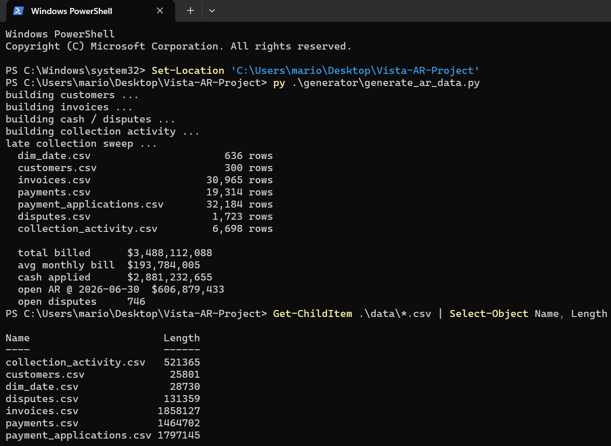
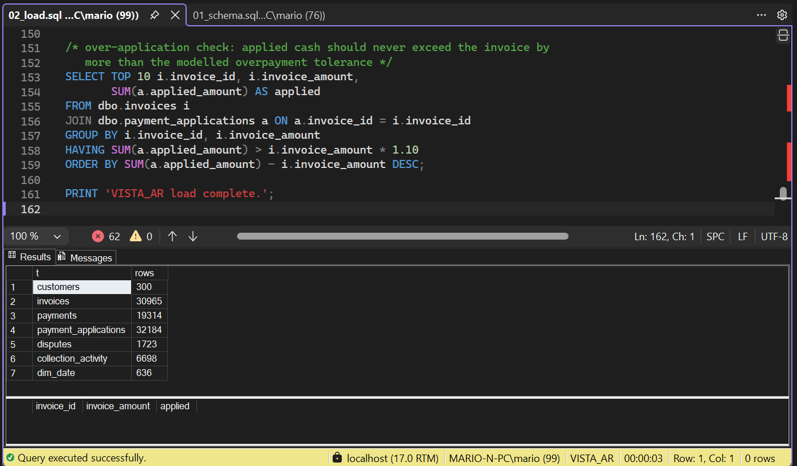
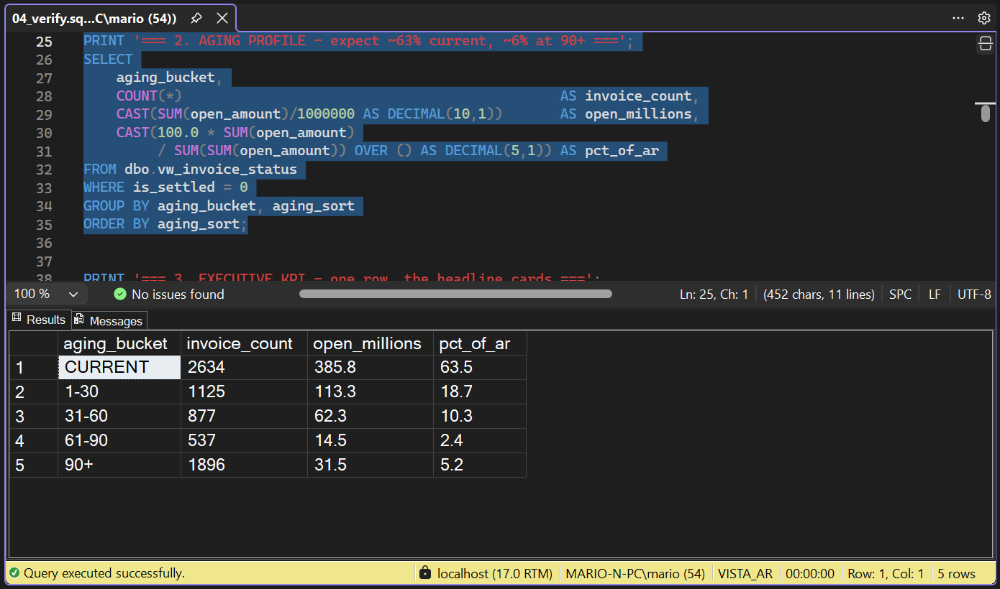
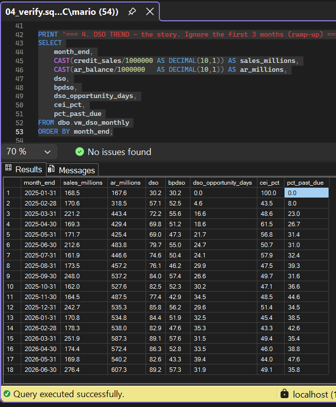
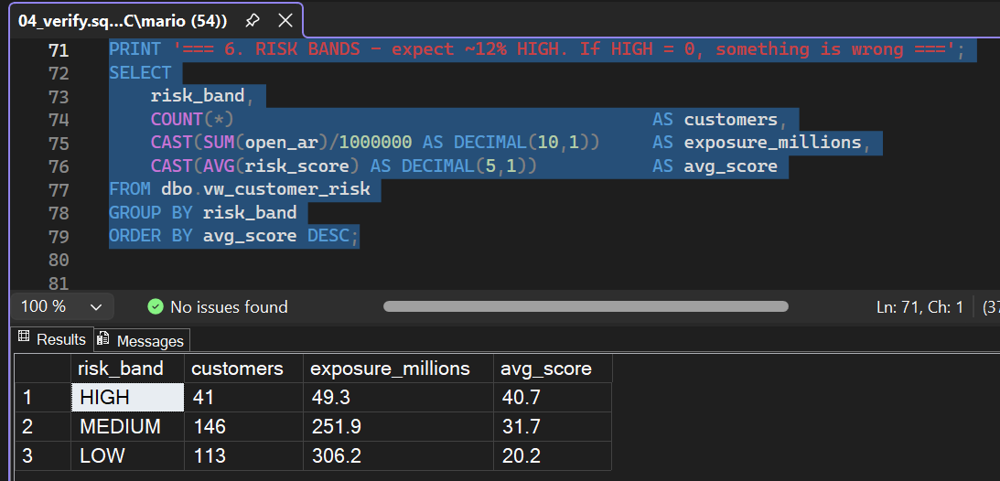
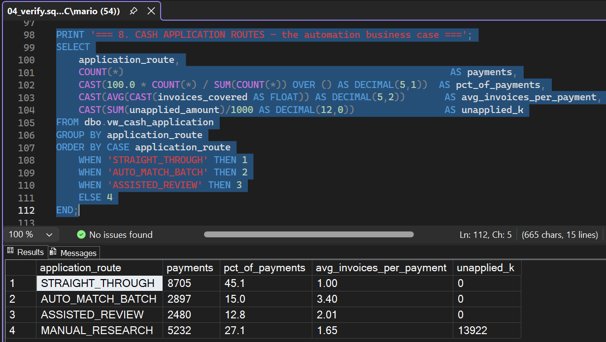
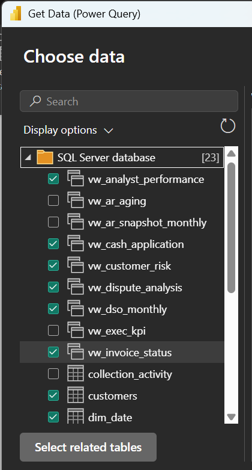
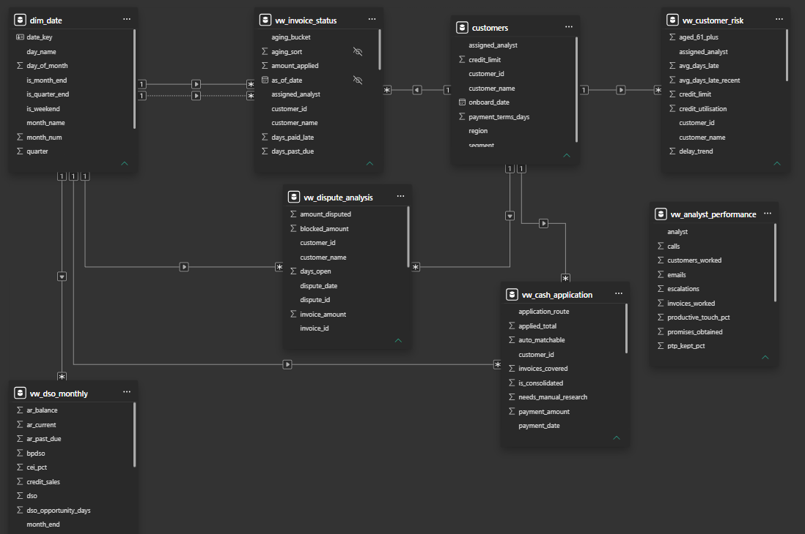

# VISTA — Build log

**Local implementation, report QA and repository publication: complete.**

This log records the executed Python → SQL Server → Power BI workflow,
the saved evidence and the design decisions behind the finished report.
Current-book analysis uses **30 June 2026**; payment and team analysis covers
**January 2025–June 2026**.

## 1. Synthetic data generation

The Python generator was executed locally and produced seven CSVs.

| Dataset | Rows |
|---|---:|
| dim_date | 636 |
| customers | 300 |
| invoices | 30,965 |
| payments | 19,314 |
| payment_applications | 32,184 |
| disputes | 1,723 |
| collection_activity | 6,698 |

The generated scenario contains **$3.49B billed**, **$2.88B cash applied** and
**$606.9M net AR** at the reporting cutoff.

## 2. SQL Server ingestion

The schema and loader were executed against `VISTA_AR`. All seven typed-table
counts match the generated CSVs. The over-application query returned no invoices
exceeding its **110%** tolerance threshold.

## 3. SQL verification and report reconciliation

The analytical views and verification script were executed. Selected result
grids preserve the reference values used to reconcile the Power BI report.

| Check | Recorded result |
|---|---|
| Aging | Current $385.8M; 1–30 $113.3M; 31–60 $62.3M; 61–90 $14.5M; 90+ $31.5M |
| June DSO | DSO 89.2; BPDSO 57.3; opportunity gap 31.9 days |
| Risk bands | HIGH 41 / $49.3M; MEDIUM 146 / $251.9M; LOW 113 / $306.2M |
| Payment routes | Straight-through 8,705; batch-matchable 2,897; assisted review 2,480; manual research 5,232 |

**Aging profile**

**Monthly DSO**

**Customer risk bands**

**Cash-application routes**

Power BI displays **$607.3M gross open AR**, excluding settled invoices and
credit balances. The generator's **$606.9M** includes credit balances.
Current-book past due is **36.5%**, while the June monthly snapshot shows
**35.8%** because invoices due on the cutoff date are classified differently.

The ten SQL verification blocks were rerun successfully against local
`VISTA_AR` on **5 October 2026**.
[Executed SQL output](../screenshots/sql/verification-output.txt) records that
run. The SQL screenshots preserve the original execution result grids.

The report also shows **746 open disputes**, **$31.3M** disputed value,
**6,698 collection touches**, **2,043 promises obtained** and **$13.9M**
recorded as unapplied cash.

## 4. Power BI semantic model

The report imports `dim_date`, `customers` and six analytical views:
`vw_invoice_status`, `vw_cash_application`, `vw_dispute_analysis`,
`vw_analyst_performance`, `vw_dso_monthly` and `vw_customer_risk`.

The model uses single-direction relationships from the date and customer
dimensions. The invoice due-date relationship is inactive, and the full-period
analyst aggregate is disconnected. Raw invoice and payment-application tables
are excluded from the report model.

**Import selection**

**Model relationships**

[Model and DAX specification](../powerbi/04_dax_measures.md)

### Technical checkpoints and evidence

| Technical work | Recorded evidence |
|---|---|
| Schema constraints, staging and typed conversion | SQL load screenshot and seven matching table counts. |
| Month-end CTEs and rolling-window DSO calculations | Verification block 4 and the June DSO/BPDSO result grid. |
| Payment-level aggregation and `CASE` classification | Block 8 and the four mutually exclusive route counts. |
| Shared dimensions and relationship direction | Import selection and model screenshots above. |
| DAX filter context and calculation scope | Recorded headline reconciliation and comparison of all 33 saved measure expressions with the specification. |

The [technical overview](../README.md#technical-implementation) embeds selected
SQL and DAX expressions; the [deep dive](PROJECT_DEEP_DIVE.md) explains their
design. These checkpoints connect the implementation to the saved evidence.

## 5. Analytical report

The report translates current AR, historical DSO, customer risk, disputes,
analyst activity and cash-application routes into five analytical pages.

### Executive

### Aging & Risk

### Disputes

### Team Performance

### Cash Application

## 6. Interaction design and validation

Interactions were designed for each page's purpose and model grain.

| Page | Interaction design |
|---|---|
| Executive | Month and segment selections leave the headline cards and other chart unchanged, preserving the June close and company-wide DSO scope. |
| Aging & Risk | Segment and Analyst filter aging, matrix and risk. Aging chart and matrix are configured to filter each other and the risk table. Invoice-bucket filters do not propagate back through the single-direction customer relationships; customer risk scores remain fixed. Risk-table selections leave other visuals unchanged. |
| Disputes | Segment filters all data visuals. Reason selection filters cards, oldest cases and detail; selecting a case filters only detail. Detail selections leave other visuals unchanged. OPEN and Top 10 filters remain in place. |
| Team Performance | Analyst selection in either chart or table filters both cards and the other visual. Clearing the selection restores the team view; the full reporting period stays fixed. |
| Cash Application | Segment and dates filter all data visuals. Route and quality charts filter cards and each other, leaving slicers unchanged. Percentages reflect the selected payment context. |

Filtering uses **Filter**, with **None** for the destinations intended to stay
unchanged. The static headings and takeaways retain their original text;
Cash's **Unfiltered view** figures describe the baseline.

The table records the current saved interaction configuration. Screenshots and
the PDF preserve the unfiltered baseline; the walkthrough demonstrates selected
interactive transitions.

On **5 October 2026**, the saved report configuration was finalized with explicit
Filter/None rules and the unrelated dispute-filter entries removed from Team
and Cash visuals. Power BI's package validation passed, and the four changed
page definitions passed their published Microsoft JSON schemas. The embedded
data model remained byte-for-byte unchanged.

The corrected report reopened in Power BI Desktop. A read-only DAX query
reconciled its headline measures with the reference results, and all 33 saved
measure expressions matched the model specification. These checks verify the
package, saved configuration and calculations; interactive UI checks were not
repeated during this finalization.

The five-page PDF was visually reviewed, and the 61-second walkthrough was
checked for readable report content and filtering examples. The published video
player was verified for browser playback and seeking.

## 7. Completed implementation

The completed pipeline turns seven synthetic datasets into nine SQL analytical
views and a five-page Power BI report with 33 DAX measures. SQL resolves balances,
historical snapshots and payment classifications; the model and DAX handle
report grain and filter context. The results were reconciled against SQL
verification output.

Cash-application routes describe eligibility under classification rules.
The [design roadmap](PROJECT_DEEP_DIVE.md#roadmap) covers planned extensions.

## Publication

**Published on 5 October 2026.**

[Public GitHub repository](https://github.com/mario-narvaez/Vista-AR-Project)

| Deliverable | Purpose |
|---|---|
| [Power BI report](../powerbi/VISTA-Power_BI_Report.pbix) | Five-page interactive report and imported model; requires Power BI Desktop. |
| [Report PDF](../powerbi/VISTA-Power_BI_Report_PDF.pdf) | Static views of all five report pages. |
| [Report walkthrough](https://mario-narvaez.github.io/Vista-AR-Project/) | 61-second browser demonstration of navigation and filtering; [download MP4](../powerbi/VISTA-Power_BI_Report_Walkthrough.mp4). |

The repository includes the Python generator, synthetic CSVs, SQL scripts,
complete DAX reference and build evidence. The [README](../README.md) brings
together the report viewing options, technical examples, findings and limitations.
